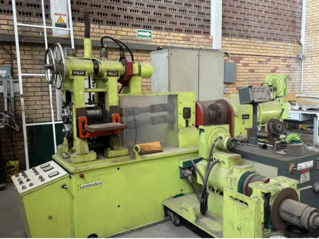
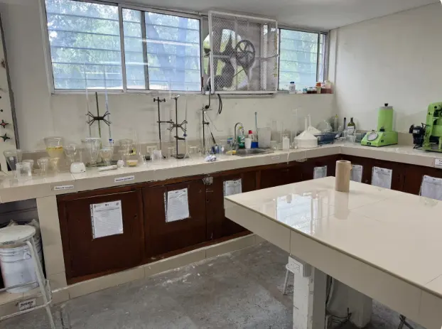
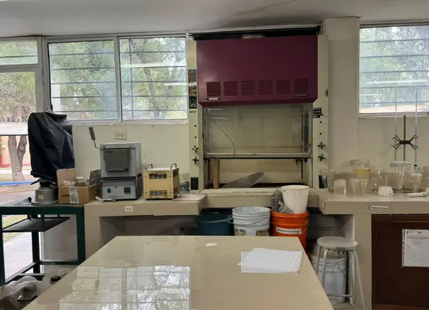
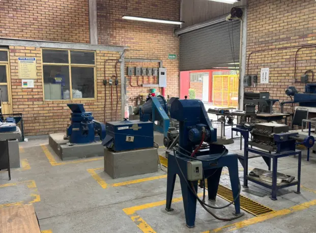
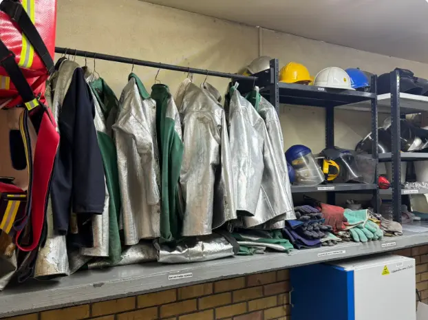
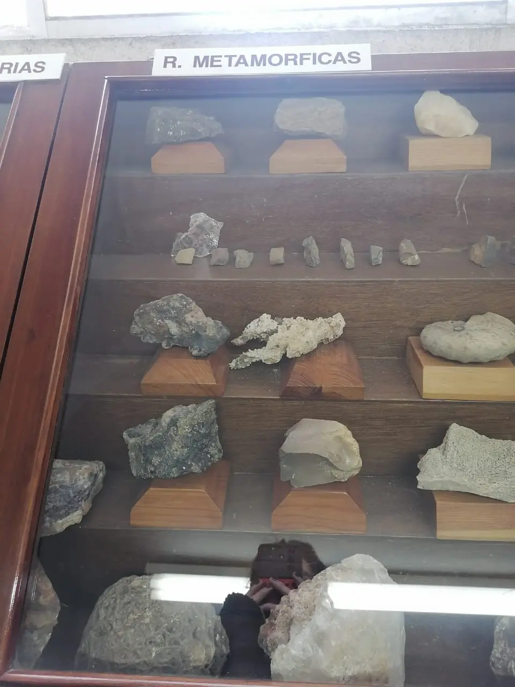
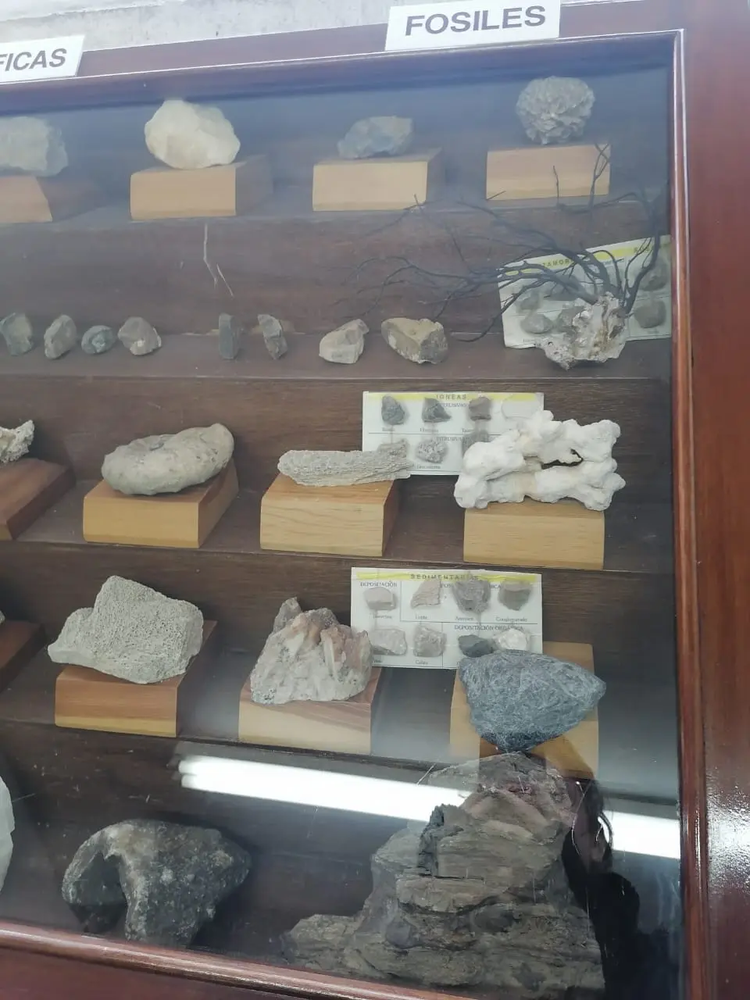
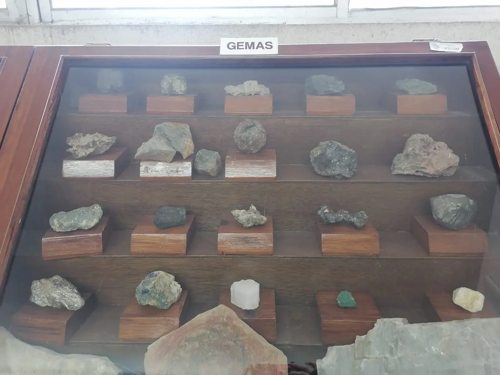
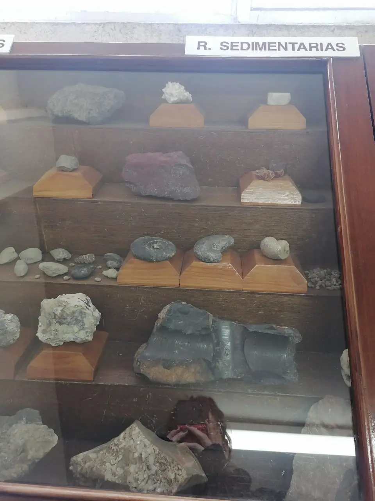

+++
date = '2026-03-11T00:50:53-06:00'
draft = false
title = 'Laboratorio de mecánica'
author = "David S."
image = "cover.webp"
weight = 2

[menu]
  [menu.main]
  identifier = "lab_mecanica"
  name = "Laboratorio de mecánica"
  weight = -99

    [menu.main.params]
    icon = "number-2"
+++
El Laboratorio de Mecánica es un espacio académico diseñado para apoyar la formación práctica de estudiantes de las ingenierías Mecánica, de Materiales, Industrial y Mecatrónica. Su función principal es servir como complemento a las materias del área mecánica que forman parte del tronco común de estas carreras, permitiendo que los alumnos desarrollen habilidades experimentales, realicen mediciones y comprendan de manera práctica los conceptos vistos en clase.

En este laboratorio se llevan a cabo prácticas relacionadas con diversas asignaturas fundamentales como Mecánica de Materiales I y II, Diseño Mecánico, Metrología y Normalización, Termodinámica, Transferencia de Calor, Máquinas de Fluidos Compresibles e Incompresibles, y Sistemas e Instalaciones Hidráulicas.

El espacio cuenta con personal encargado de apoyar el desarrollo de las prácticas y asegurar el correcto funcionamiento del equipo. El laboratorio está conformado por un jefe de laboratorio, así como un auxiliar en el turno matutino y otro en el turno vespertino.

## Historia

El Laboratorio de Mecánica fue creado en el año 1970 con el objetivo de fortalecer la enseñanza práctica en las áreas relacionadas con la ingeniería mecánica dentro del instituto. A lo largo de su historia ha sido dirigido por distintos responsables que han contribuido al desarrollo y mantenimiento del espacio.

Desde 1998 el laboratorio se encuentra bajo la dirección del encargado actual, quien supervisa el funcionamiento de las instalaciones, la organización de las prácticas y el mantenimiento del equipo.

## La actualidad

Actualmente el laboratorio cuenta con diferentes áreas especializadas que permiten realizar prácticas en distintos campos de la ingeniería mecánica. Entre los principales sublaboratorios y equipos disponibles se encuentran:

* Área de **Metrología**
* Área de **Fluidos**
* Área de **Refrigeración**
* Sistemas de **ventiladores y bombas hidráulicas**
* Área de **combustión interna**
* **Turbinas**
* Área de **pruebas destructivas**

Además de las prácticas académicas, en algunas áreas del laboratorio se organizan seminarios y exposiciones técnicas, especialmente en el sublaboratorio de metrología, lo que permite complementar la formación de los estudiantes con actividades de divulgación y aprendizaje especializado.

En cuanto al mantenimiento del equipo, este se realiza principalmente de manera correctiva cuando se detecta alguna falla. Sin embargo, también se llevan a cabo revisiones preventivas anuales con el objetivo de mantener las instalaciones y los instrumentos en condiciones adecuadas de operación.

El laboratorio también recopila retroalimentación de los estudiantes mediante encuestas electrónicas en las que se evalúa el estado del equipo y las instalaciones, así como posibles mejoras.

### Información importante

#### Horario de uso

| **Turno matutino** | **Turno vespertino** | **Horario de acceso para estudiantes** |
|---|---|---|
| 7:00 a.m. a 2:45 p.m. | 2:00 p.m. a 9:00 p.m. | 7:00 a.m. a 9:00 p.m. |

#### Requisitos para ingresar al laboratorio

Para poder ingresar al laboratorio es obligatorio cumplir con ciertas medidas de seguridad:

* Usar **pantalón**
* Llevar **camisa cerrada**
* Utilizar **zapatos cerrados**

No se permite el acceso con **faldas ni sandalias**.
Además, los profesores deben solicitar las prácticas con anticipación para poder programarlas dentro del calendario del laboratorio.

#### Organización del departamento

El laboratorio pertenece al **Departamento de Metal-Mecánica**.

[//]: # (De acuerdo con información proporcionada por personal del laboratorio, el jefe del departamento es el **Ing. Gerardo Sánchez Games**, con apoyo de **Gerardo Medina** y **René Betancur**.)

En el organigrama oficial del Tecnológico de Saltillo aparece como responsable del departamento el **Dr. Dagoberto Vázquez Obregón**.

#### Reglamento básico para el uso del laboratorio

Para garantizar el uso adecuado de las instalaciones, los usuarios deben seguir las siguientes reglas:

1. Toda persona que desee utilizar el laboratorio debe contar con autorización del coordinador del área correspondiente y registrar su entrada en el libro de control.
2. El horario preferente de uso es de lunes a viernes de **9:00 a 13:00 horas** y de **15:00 a 19:00 horas**.
3. En casos especiales se puede solicitar la llave del laboratorio al coordinador del área.
4. Los trabajos de servicio externo solo se realizarán si no interfieren con los proyectos de investigación vigentes.
5. Los equipos y materiales no deben salir del laboratorio sin autorización del coordinador.
6. Es obligatorio mantener **orden y limpieza**. Está prohibido consumir alimentos, bebidas o fumar dentro de las instalaciones.
7. Todos los materiales utilizados deben estar **etiquetados** con nombre del usuario, tipo de material y proyecto.
8. Antes de usar cualquier equipo es necesario conocer sus **instrucciones de operación**.
9. El uso de equipos delicados requiere **capacitación previa** bajo supervisión del coordinador del área.
10. Cualquier anomalía o falla en el equipo debe registrarse en el libro y reportarse al coordinador. No se deben realizar reparaciones por cuenta propia.

### Fotografías del laboratorio

