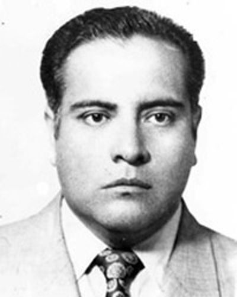

Desde los inicios del Tecnológico de Saltillo, el Laboratorio de Materiales se estableció como un componente esencial para proporcionar a los estudiantes experiencias prácticas en la caracterización y análisis de diversos materiales. Este laboratorio ha sido fundamental para el desarrollo de proyectos de investigación y para la formación de profesionales capaces de enfrentar los desafíos tecnológicos del sector industrial.

A lo largo de los años, el laboratorio ha sido equipado con herramientas y maquinaria especializada para realizar ensayos mecánicos, térmicos y estructurales en materiales metálicos, cerámicos y compuestos. Estos equipos permiten a los estudiantes y docentes llevar a cabo investigaciones aplicadas y desarrollar soluciones innovadoras para la industria y equipamiento.

Es importante notar que este laboratorio está compuesto del laboratorio de metalurgia, laboratorio de pruebas y ensayos, y el laboratorio de materiales avanzados. Pero para comprender cómo se ha llegado a este punto, hace falta mencionar a los pioneros, aquellos que hicieron posible lo que hoy es, gracias a su esfuerzo y amor por la educación que hoy nos sustenta.

## Historia
---

### Los inicios: La carrera Ingeniería en Metalurgia
Entre 1973 y 1976, Rodolfo Rosas Morales estuvo al frente del entonces Instituto Tecnológico Regional de Coahuila, hoy conocido como Tecnológico Nacional de México Campus Saltillo. Su gestión comenzó poco después de que la institución celebrara sus primeros 20 años de historia, en un momento clave de transformación para el sistema de institutos tecnológicos en el país.

Fotografía de Rodolfo Rosas Morales

Durante su dirección, Rosas Morales impulsó de manera importante la Primera Reforma Educativa dentro de los Institutos Tecnológicos, participando activamente en su implementación y promoviendo cambios académicos que buscaban modernizar la formación de los estudiantes. Uno de los avances más destacados de este periodo fue la creación del Centro de Idiomas, una iniciativa que amplió las oportunidades de preparación para la comunidad estudiantil.

En el ámbito académico también se registraron avances relevantes. En 1975 se abrieron dos nuevos programas: la carrera de Técnico en Comercio Internacional y la **Ingeniería en Metalurgia**, ampliando así la oferta educativa del instituto y respondiendo a las necesidades del desarrollo industrial de la región.

Hacia el aniversario número 25 de la institución, desde la Dirección General de los Institutos Tecnológicos se comenzó a fortalecer el Sistema Nacional de Educación Tecnológica. En ese contexto, también se inició la introducción de programas de posgrado con el objetivo de impulsar la investigación científica dentro de los tecnológicos del país.

Para el Tecnológico Regional de Coahuila se definió un enfoque particular en el área de investigación en metalurgia. Esta decisión marcó el inicio de una etapa de preparación institucional que sentaría las bases para la futura llegada de los programas de posgrado y el desarrollo de investigación especializada.

### La fundación de los laboratorios
Entre noviembre de 1981 y noviembre de 1983, Carlos Herrera Pérez asumió la dirección del Instituto Tecnológico Regional de Coahuila, institución que formaba parte ya entonces del Tecnológico Nacional de México. Su gestión marcó un momento significativo, ya que se convirtió en el primer egresado del propio instituto en llegar a ocupar el cargo de director. Herrera Pérez se había formado en la carrera de Ingeniería Eléctrica dentro de la misma institución.

Durante su administración se impulsó el desarrollo académico del tecnológico, en un contexto en el que el sistema de institutos tecnológicos del país continuaba creciendo. En este periodo también se consolidó el cambio de denominación de la institución, pasando de llamarse Instituto Tecnológico Regional de Coahuila a Instituto Tecnológico de Saltillo, nombre con el que se le conoce actualmente.

Fotografía de Carlos Herrera Pérez

Uno de los enfoques importantes de su gestión fue el fortalecimiento del posgrado en metalurgia. Para ello, **se reforzó la planta docente de la Maestría en Metalurgia** con la incorporación de doctores en Ciencias de Metalurgia provenientes de la Universidad de Minas de Cracovia, en Polonia. Esta colaboración académica contribuyó a elevar el nivel de especialización y de investigación dentro del instituto.

En el ámbito de infraestructura, durante su dirección también se concluyeron proyectos relevantes para la comunidad tecnológica. Se inauguró la alberca olímpica, cuya construcción había sido iniciada por Luis Rosales Celis, y se promovió la **creación e inauguración del Laboratorio de Investigación en Metalurgia**, un espacio clave para el desarrollo científico en esta área dentro de la institución.

## La actualidad
---

El laboratorio de materiales del Instituto Tecnológico de Saltillo **está orientado principalmente a la formación práctica de los estudiantes de la carrera de Ingeniería en Materiales**. Su funcionamiento responde a un objetivo claro: complementar la formación teórica mediante el uso de equipo especializado y prácticas experimentales relacionadas con el estudio, caracterización y comportamiento de distintos materiales.

El acceso al laboratorio está regulado para garantizar tanto la seguridad de los usuarios como el uso adecuado de las instalaciones. Por ello, está destinado principalmente a estudiantes de Ingeniería en Materiales que ya hayan cursado y aprobado una serie de asignaturas fundamentales dentro de su formación, entre ellas física del estado sólido, termodinámica aplicada a materiales, caracterización estructural, comportamiento mecánico de materiales, diagramas de equilibrio, fenómenos de transporte y técnicas de análisis, entre otras materias clave del área.

**Además del requisito académico, el uso del laboratorio exige el cumplimiento estricto de normas de seguridad**. Los estudiantes deben contar con equipo de protección personal adecuado, como guantes resistentes a productos químicos, gafas de seguridad, bata de laboratorio y calzado cerrado, elementos indispensables para realizar prácticas de forma segura.

El laboratorio también cuenta con personal especializado en ciencias de materiales. Su equipo está integrado por un jefe de laboratorio, técnicos especializados y asistentes de investigación que brindan apoyo durante las prácticas, además de colaborar en proyectos académicos y de investigación que se desarrollan dentro de estas instalaciones. Este soporte técnico resulta clave para el correcto funcionamiento del laboratorio y para el aprovechamiento académico de los estudiantes.

Organigrama del Laboratorio de materiales

### Información importante
---

#### Horario de uso
El laboratorio está disponible para prácticas programadas de **lunes a viernes, en un horario de 8:00 a.m. a 6:00 p.m**. En el caso de proyectos de investigación o actividades especiales, es posible solicitar horarios extendidos, siempre con autorización previa.

#### Contacto
Coordinación Mecánica–Materiales: María Elena
Teléfono: 844 255-7650

#### Eventos académicos relacionados
Dentro de las actividades académicas vinculadas al área de materiales destacan los congresos especializados organizados por la institución, entre ellos el Congreso Internacional de Metalurgia y Materiales, donde se presentan temas relacionados con metalurgia, materiales cerámicos, polímeros, materiales compuestos, nanotecnología y procesos de manufactura.

### Fotografías del laboratorio
---

</head>

